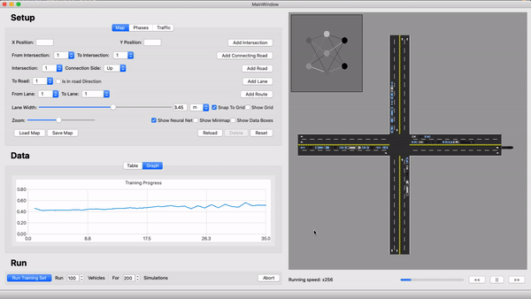

# TMS - Traffic Management System
> An artificially-intelligent traffic managent system

## Table of contents
* [General info](#general-info)
* [Screenshots](#screenshots)
* [Technologies](#technologies)
* [Features](#features)
* [Inspiration](#inspiration)
* [Contact](#contact)

## General info
This project is my CS Technician degree's final project.
The goal of this project was mainly to learn the concept
of neural network as an introduction to artificial intelligence,
and to learn and to build experience with the C++ language.

This project simulates a network of intersections, and aims to improve the traffic flow by using neural network to manage
the traffic lights.

Here a links to some videos:
* [Project Explanation (Hebrew)](https://www.youtube.com/watch?v=xJOcDKXWJXo)
* [Project Demonstration](https://www.youtube.com/watch?v=BLz_PdU2oyo)

Explanetaion docs:
* [Documentation (Hebrew)](./docs/project_book)
* [Summary Presentation](./docs/english/summary_presentation)
* [AI Explanetion Presentation](./docs/english/AI_presentation)

## Screenshots

## Technologies
* SFML - version 2.5.1
* CMake - version 3.15.1
* Qt - version 5.14.1

## Features
List of features ready and TODOs for future development
* Build a new traffic map from scratch
* Set up the traffic behaviour
* Run Simulations and train the neural-network
* Visualise the neural-network's progress with graphs and visual aids

To-do list:
* Add Windows support

## Status
Project is: _in progress_.

## Inspiration
TMS was inspired by the big traffic problem that exists in Israel.

Though this project is not aimed towards real life use, it can be seen as a *Proof of concept*

### Contact
samuel.arbibe@gmail.com
